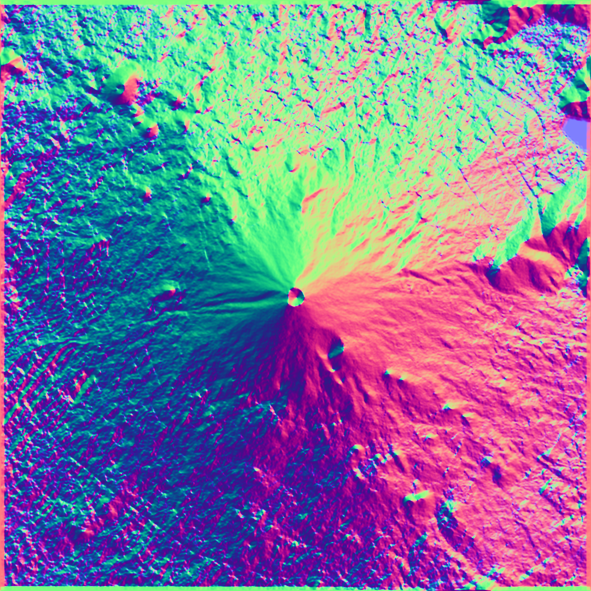
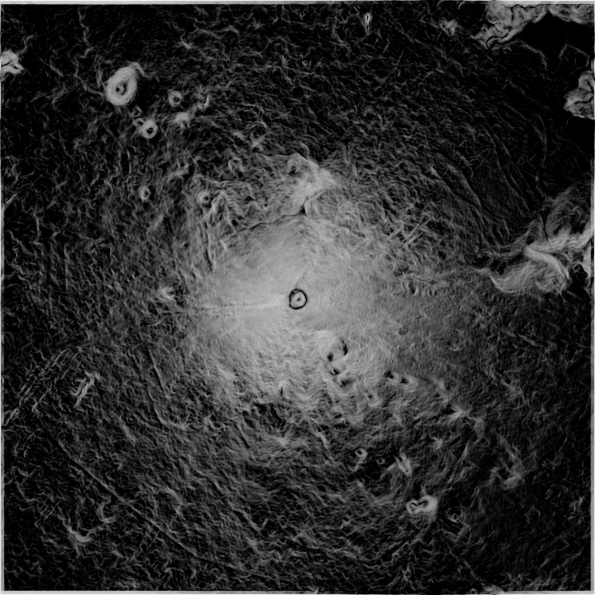

height2normal is python3 script to convert height map ping image to normal map png.

## dependency
height2normal.py depends on python3 modules argparse, textwrap, pillow and numpy.

## How to use
usage is below:

`height2normal.py [-h] [-n FILE] [-z FILE] [-t TAPNUM] [-r VHRATIO] [-d DIFF] [-g GAMMA] [-e EXPAND] [-b BLUR] [-s SIGMA] FILE`

easily, execute as follows.

` height2normal.py FILE`

you can get two output file normalmap.png and zanglemap.ping at same directory.
File that input file should be grayscale png image. given rgb image will be converted as grayscale.

for example, input FILE is below  

` height2normal.py fuji_Height_Map_Merged.png`

input FILE is below.
 

you can get following two images.  
as normalmap.png
 

also as zanglemap.png
 

## optional arguments
height2normal.py has some optional argument parameters.
you can change the parameters depending on the your heightmap image.

##### -h, --help
    show this help message and exit  
##### -n FILE, --normal FILE  
    output file name of normal-map PNG image.
    file name extension must be '.png'.
#####  -z FILE, --zangle FILE
    output file name of z-angle-map PNG image.
    file name extension must be '.png'.
#####  -t TAPNUM, --tapnum TAPNUM
    tap num of interpolation filter.
    it must be 3 or more odd int num.
#####  -r VHRATIO, --vhratio VHRATIO
    Vertical/Horizontal ratio.
    it must be positive real num.
#####  -d DIFF, --difference DIFF
    difference value of differential.
    it must be 0.1 or less small positive real num.
#####  -g GAMMA, --gamma GAMMA
    gamma value for z-angle image.
    it must be positive real num.
#####  -e EXPAND, --expand EXPAND
    Image expand method.
    0: use opposit side image as tile
    1: use edge pixel repetition
#####  -b BLUR, --blur BLUR
    use blur or not.
    0: not use
    3 or more odd int num: use blur
    when blur is used, num is size of kernel matrix
#####  -s SIGMA, --sigma SIGMA
    sigma value for Gaussian Blur.
    it must be positive real num
